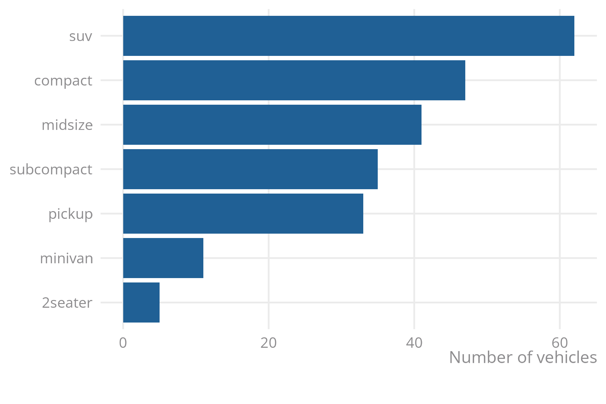
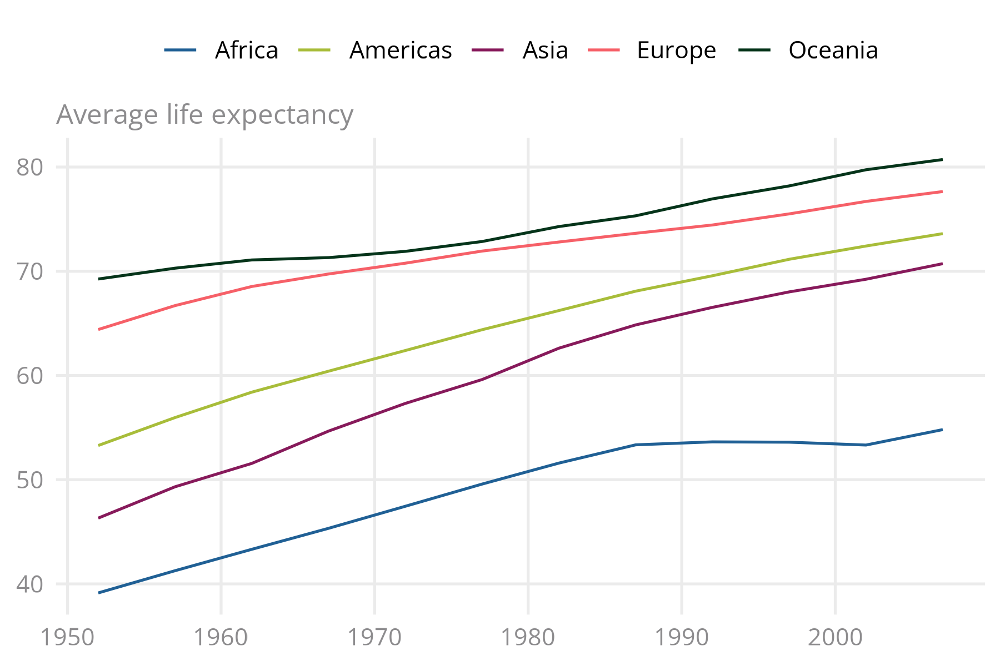

<!-- badges: start -->
  [](https://github.com/nrennie/ggONS/actions)
<!-- badges: end -->

# ggONS 

This R package contains:

* scale and theme functions for use with {ggplot2};
* template for revealjs Quarto presentations;

## Examples

Load 'ggplot2' and 'ggONS':

```r
library(ggplot2)
library(ggONS)
```

### Single colour

Use `ocean_blue` if only requiring one colour:

```r
ggplot(
  data = mpg,
  mapping = aes(y = reorder(class, class, function(x) length(x)))
) +
  geom_bar(fill = ocean_blue) +
  labs(x = "Number of vehicles") +
  theme_ONS() 
```



### Multiple colours

```r
library(gapminder)
gapminder |> 
  dplyr::group_by(year, continent) |> 
  dplyr::summarise(meanLifeExp = mean(lifeExp)) |> 
  dplyr::ungroup() |> 
  ggplot(
    mapping = aes(x = year, y = meanLifeExp, colour = continent)
  ) +
  geom_line() +
  # Use colour scale with categorical palette
  scale_colour_ONS_d() +
  # Use tag instead of `y` for horizontal orientation
  labs(x = NULL, tag = "Average life expectancy") +
  theme_ONS() 
```


